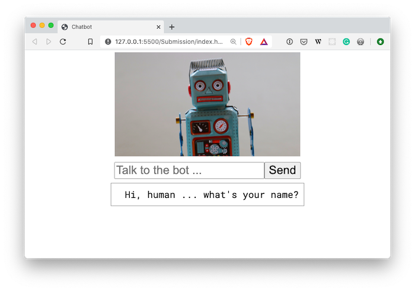
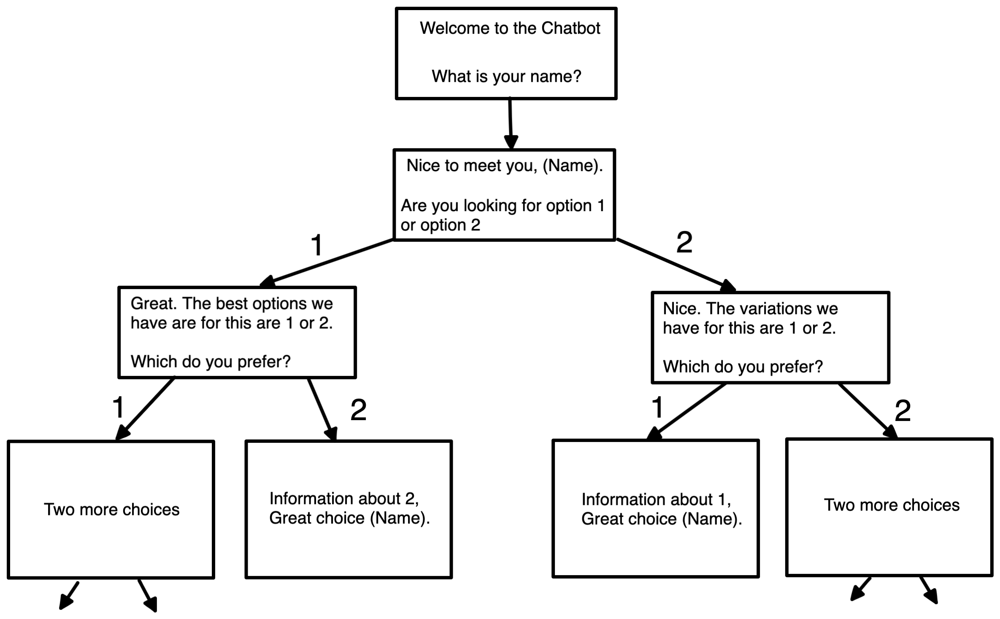

# 01 Project - Build a Chatbot

Write logic for a chatbot to reply to user input

---

## Assessment details

- Assesment details are on iQualify classroom

---

## Project Brief

Build a chatbot that helps your customer solve a problem. Your customer will be able to enter text into a form, and your bot should analyse the text and respond accordingly.



---

## Rationale

This project is the combination and application of things you have learnt about JavaScript so far.

Use conditionals, comparisons, and built-in methods such as string and array methods, to apply logic to a program. Write functions and leverage scope to give your bot a memory.

---

## Getting Started

1. `clone` the project repository to your local computer using VS Code
2. **Important** Open your terminal, and type: `npm install`
3. Install the [ESLint VS Code Plugin](https://marketplace.visualstudio.com/items?itemName=dbaeumer.vscode-eslint). This will show you errors in your JavaScript in VS Code (red squiggles), so you can fix them.
4. The code for this project should go into `/Submission/planning` and `Submission/script.js`.
5. Read through this entire document before you begin

---

## Instructions Part A - Solving a problem

<details>
<summary>Solving a problem</summary>
<br>

You are going to build a helpful chatbot, that will solve a problem for your customer. Your chatbot should have its own personality, and the problem it solves can be anything you like.

Some examples of problems that your chatbot could help with:

- What should I have for dinner? ([example](https://www.tasteofhome.com/article/what-should-i-make-for-dinner/))
- What movie should I watch? ([example](https://www.buzzfeed.com/spenceralthouse/what-movie-should-i-watch-tonight-quiz))
- Ordering a Pizza to be delivered ([example](https://www.youtube.com/watch?v=DU4m_mJP0Uo))
- A self care Chatbot ([example](https://philome.la/jace_harr/you-feel-like-shit-an-interactive-self-care-guide/play/index.html))

Once you have decided on what problem your Chatbot will solve, write a problem statement. This should include what problem your Chatbot will solve for customers. Use a tool like Grammarly to help fix spelling and grammatical errors.

**Acceptance criteria**

1. Write the problem statement that your Chatbot will be solving for a customer in the file located at `Submission/planning/problem.md`
   - Optional: You can use Markdown text formatting in your `problem.md` file. See [Mastering Markdown](https://masteringmarkdown.com/) by Wes Bos to learn how to use markdown.
2. Commit this change to git

</details>

## Instructions Part B - Planning

<details>
<summary>Plan your Chatbot</summary>
<br>

Now you have your problem defined, it's time to plan how to implement the Chatbot.

Draw some flow charts to determine the paths that customers can take when talking to the Chatbot. Don't forget to plan for situations when your Chatbot cannot understand the reply from the customer. Create a flowchart using an online tool such as [Excalidraw](https://excalidraw.com/) or [Miro](https://miro.com/)

Think about what information you need from the customer at each point, and determine how you can understand the customer using JavaScript. Also, think about what you need the Chatbot to ask and reply with to be able to progress to the next step in your flow chart.



Your Chatbot conversation should have 2 paths the customers can follow. For example, if you are building a Chatbot to help your customer choose a movie, you might ask them if they like Action or Romance, meaning there are two possible paths.

Your chatbot should also show some personality, maybe it tells jokes, or offers advice when asked.

**Acceptance criteria**

1. Flow chart graphics are added to the `Submission/planning` folder
2. Flow charts have no more than two paths
3. Flow charts take into account the acceptance criteria for the "Implementing your chatbot" section

**Note:** It is expected that plans change, so it's fine if what you plan doesn't match the end result.

</details>

## Instructions Part C - Add automated testing for your chatbot

<details>
<summary>Test Scenarios and automated testing</summary>
<br>

Based on your flowchart, write down some test scenarios, where you list the inputs and the outputs. An example might look like this:

```
## Path for Point Break movie

Start: What is your name?
Input: Rob
Output: Hello Rob, Do you like Romance or Action movies?
Input: Action
Output: I recommend Total Recall. Are you happy with this suggestion?
Input: No
Output: In that case, I recommend Point Break. Are you happy with this suggestion?
Input: yes
Output: Enjoy your movie!
```

You can add more test scenarios as you need.

Once you have some test scenarios, you can write automated tests for them. Writing automated tests for your JavaScript is an industry-standard practice.

Open `/test/script.test.js`, and watch the video tutorial below to understand how to write automated tests for your chatbot. **Important** watch the whole video through before attempting to follow along.

[Write automated tests for your Chatbot](https://www.loom.com/share/debdef7b19644366a4cd385fa0aa0b89)

**Acceptance criteria**

1. Test scenarios are added to `Submission/planning/problem.md`
2. Automated tests are written and pass for test scenarios 
3. Automated tests have good test descriptions, that indicate the scenario that is under test

</details>

## Instructions Part D - Implementing your Chatbot

<details>
<summary>Implementing your Chatbot</summary>
<br>

Use your plan to break down your project into small tasks. Don't try and do everything at once, it will be overwhelming.

It's a good idea to break down your tasks as tiny as possible. Only implement one test scenario at a time

**Acceptance criteria**

1. The chatbot asks a series of questions to the customer, which are used to solve the problem
   - There should be at least two paths the customer can follow
2. The chatbot considers the user experience by:
   -  Making the conversation flow naturally
   -  Ensuring there are no bugs where the customer gets trapped, and the bot never replies with `undefined`
3. The chatbot asks for the customer's name at the start of the conversation and refers to them by name in at least two replies
4. The chatbot can respond to at least two questions or instructions from the customer, at any time during the conversation
   - For example: restart, turn on dark mode (this might change the page design to use a black background), help, etc
5. If the chatbot doesn't understand the customer, it offers helpful messages so the customer can continue
   - For example: "I couldn't understand your reply, try answering 'yes' or 'no'"

</details>

## Instructions Part E - Deploying to Render

<details>
<summary>Deploying to Render</summary>
<br>

For a general overview of setting up Render view this [Loom video](https://loom.com/share/d2829cd646884658a1bee1e44a4108c8)

1. Sign in to [Render](https://dashboard.render.com/) with your GitHub account
2. Click on the **New +** button
3. Click on **Static Site**
4. In the following screen copy the URL of your project on GitHub (it should look like ` https://github.com/Developers-Institute-Classrooms/01-project---build-a-chatbot-XXXX`) in to the **Public Git repository** field and click **Continue**
5. You may need to connect your GitHub account to Render
6. Authorise your account
7. On the next screen on Render enter the Name as **chat-bot**
8. Set the **Publish directory** as `./Submission`
9. Click the **Create Static Site** button, and you should see a terminal in the browser
10. Once you see the message `Your site is live`, you can then click on the purple link with a URL similar to `https://chat-bot.onrender.com`
11. Save and copy the url for your new website

</details>

---

# Submit your Project

- [ ] Commits are pushed to GitHub
- [ ] Automated tests pass in GitHub
- [ ] Project is deployed to Render
